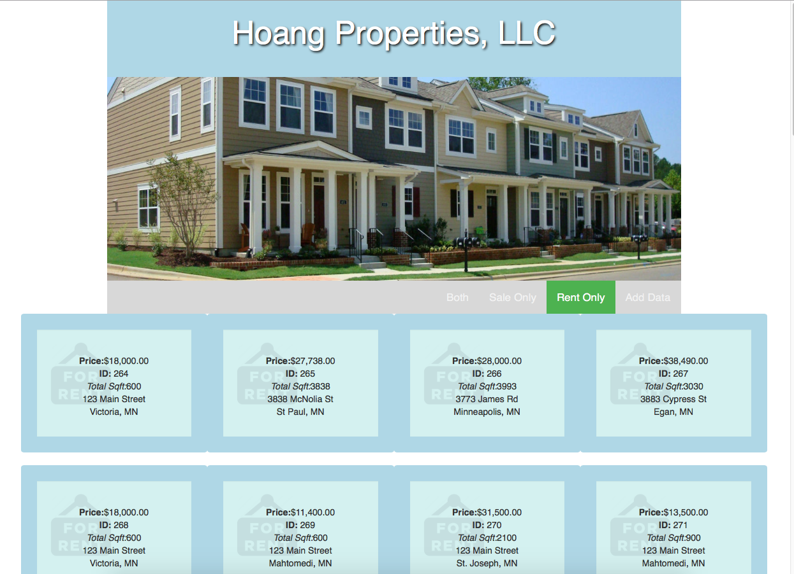

# Weekend Challenge 4 - Mongo and Bootstrap

** System Detail **

HOANG REAL ESTATE COMPANY:

* Collect the data called “listings”.
* Display the data either for Rent or for Sale.

You job, is to get this Data on the DOM, accounting for the inconsistent datatypes that are possible with MongoDB. But additionally, let’s bring in Bootstrap to the mix to make sure that the application looks as good as possible.

DISPLAY THE FUNCTION:

Here are the requirements of the project:
* Create a Full Stack application from the ground up using jQuery, Node, and MongoDB,
* Work with the data set that we provide for you,
* Use Bootstrap to present the data,
* Account for the different data (“rent” versus “cost) and ensure that this is noted on the display of the information, by listing “For Rent” or “For Sale” based on which of the two properties that it has.

To work with the provided data:
* Download the provided file,
* Run this command in your Terminal: `mongoimport --db realestate --collection listings --file listingData.js`
* Note that you will need to run this from the folder which you download the ‘listingData.js’ to.

## Hard Mode
Create an interface for adding additional properties to the collection. You will need to give the user an option for either a Rent property, or a Sale property. Check out this Stack Overflow for information on how to accomplish this:
http://stackoverflow.com/questions/14453864/use-more-than-one-schema-per-collection-on-mongodb

## Technical Used ##
Mongo, Express, Node.Js, JQuery, Bootstrap, CSS3, HTML5

 select rent only 

